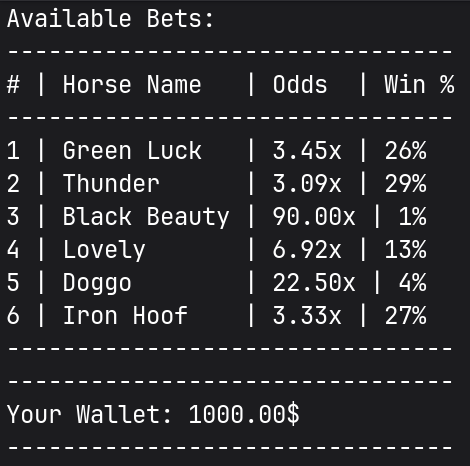

# horse-race-gamble

Terminal-based horse racing gambling game.   
Still need to add bots' betting simulation, but the core gameplay loop is mostly done.  
Any critique, suggestions, or help are very welcome — feel free to open issues or submit pull requests.   
Thanks for checking it out!  

Here are some screenshots:  

## Betting screen

Bets are randomly generated every race:  

## Player stats

Stats are updated accordingly to the game state:  

